# GDSC Drug Sensitivity Analysis
## A Data-Driven Investigation into Cancer Pharmacogenomics
**HackBio Stage 01 · Team Phenylalanine-Methionine**

---

## Abstract

Cancer treatment fails largely because drug response is heterogeneous: identical drugs produce radically different outcomes across tumour types and individual cell lines. The **Genomics of Drug Sensitivity in Cancer (GDSC)** resource addresses this by systematically profiling the sensitivity of 737 human cancer cell lines to 246 compounds, yielding 162,103 drug-response measurements annotated with multi-omic molecular features.

This report documents a full exploratory analysis of that resource. We characterise the distribution of three pharmacological readouts (LN_IC50, AUC, Z_SCORE), rank compounds by potency and response variability, map cancer-type-level sensitivity landscapes, and test whether genomic copy-number alterations, transcriptomic activity, and epigenomic methylation status are statistically associated with altered drug response. A volcano-plot-based significance framework is used to identify the molecular features with the greatest drug-specific effect sizes.

---

## 1. Background & Scientific Motivation

Drug resistance is the primary cause of treatment failure in oncology. Resistance can arise from:

- **Genomic alterations** — amplifications or deletions in DNA (Copy Number Alterations) that upregulate oncogenes or silence tumour suppressors
- **Transcriptomic reprogramming** — aberrant gene expression that rewires signalling pathways
- **Epigenomic silencing** — DNA methylation-driven suppression of drug-sensitivity genes without any change to the underlying sequence
- **Microsatellite instability (MSI)** — defective mismatch repair leading to genome-wide hypermutation, which can paradoxically increase sensitivity to certain classes of agent

Large-scale pharmacogenomic datasets like GDSC allow these resistance mechanisms to be interrogated statistically across hundreds of drugs and cell lines simultaneously — a scale impossible to achieve with traditional hypothesis-driven wet-lab experiments.

---

## 2. Dataset


### 2.1 Data Loading

```python
# Load the GDSC Excel dataset into a Pandas DataFrame
gdsc = pd.read_excel('../data/GDSC.xlsx')
```

### 2.2 Dataset Structure

Each row encodes a single drug–cell-line screening experiment. The 19 columns span four categories:

| Category | Columns |
|----------|---------|
| **Cell-line identity** | `COSMIC_ID`, `CELL_LINE_NAME`, `TCGA_DESC`, `GDSC Tissue descriptor 1/2`, `Cancer Type (matching TCGA label)` |
| **Drug identity** | `DRUG_ID`, `DRUG_NAME`, `TARGET`, `TARGET_PATHWAY` |
| **Pharmacological readouts** | `LN_IC50`, `AUC`, `Z_SCORE` |
| **Molecular annotation flags** | `CNA`, `Gene Expression`, `Methylation`, `MSI Status`, `Screen Medium`, `Growth Properties` |


```python
# Display the first few rows of the dataset to preview its structure
display(gdsc.head())
```

<details><summary>Output</summary>

```
COSMIC_ID CELL_LINE_NAME TCGA_DESC  DRUG_ID     DRUG_NAME   LN_IC50  \
0     683667         PFSK-1        MB     1003  Camptothecin -1.463887   
1     687448       COLO-829      SKCM     1003  Camptothecin -1.235034   
2     687455            RT4      BLCA     1003  Camptothecin -2.963191   
3     687457          SW780      BLCA     1003  Camptothecin -1.449138   
4     687459         TCCSUP      BLCA     1003  Camptothecin -2.350633   

        AUC   Z_SCORE GDSC Tissue descriptor 1 GDSC Tissue descriptor 2  \
0  0.930220  0.433123           nervous_system          medulloblastoma   
1  0.867348  0.557727                     skin                 melanoma   
2  0.821438 -0.383200        urogenital_system                  Bladder   
3  0.905050  0.441154        urogenital_system                  Bladder   
4  0.843430 -0.049682        urogenital_system                  Bladder   

  Cancer Type (matching TCGA label) Microsatellite instability Status (MSI)  \
0                                MB                               MSS/MSI-L   
1                              SKCM                               MSS/MSI-L   
2                              BLCA                               MSS/MSI-L   
3                              BLCA                               MSS/MSI-L   
4                              BLCA                               MSS/MSI-L   

  Screen Medium Growth Properties CNA Gene Expression Methylation TARGET  \
0             R          Adherent   Y               Y           Y   TOP1   
1             R          Adherent   Y               Y           Y   TOP1   
2         D/F12          Adherent   Y               Y           Y   TOP1   
3         D/F12          Adherent   Y               Y           Y   TOP1   
4         D/F12          Adherent   Y               Y           Y   TOP1   

    TARGET_PATHWAY  
0  DNA replication  
1  DNA replication  
2  DNA replication  
3  DNA replication  
4  DNA replication
```

</details>

```python
print("Shape of the dataset:")
display(gdsc.shape)
```

<details><summary>Output</summary>

```
Shape of the dataset:

(162103, 19)
```

</details>

```python
# Display dataset information including column types and non-null count
print("Dataset informations\n")
display(gdsc.info())
```

<details><summary>Output</summary>

```
Dataset informations

<class 'pandas.core.frame.DataFrame'>
RangeIndex: 162103 entries, 0 to 162102
Data columns (total 19 columns):
 #   Column                                   Non-Null Count   Dtype  
---  ------                                   --------------   -----  
 0   COSMIC_ID                                162103 non-null  int64  
 1   CELL_LINE_NAME                           162103 non-null  object 
 2   TCGA_DESC                                162103 non-null  object 
 3   DRUG_ID                                  162103 non-null  int64  
 4   DRUG_NAME                                162103 non-null  object 
 5   LN_IC50                                  162103 non-null  float64
 6   AUC                                      162103 non-null  float64
 7   Z_SCORE                                  162103 non-null  float64
 8   GDSC Tissue descriptor 1                 162103 non-null  object 
 9   GDSC Tissue descriptor 2                 162103 non-null  object 
 10  Cancer Type (matching TCGA label)        162103 non-null  object 
 11  Microsatellite instability Status (MSI)  162103 non-null  object 
 12  Screen Medium                            162103 non-null  object 
 13  Growth Properties                        162103 non-null  object 
 14  CNA                                      162103 non-null  object 
 15  Gene Expression                          162103 non-null  object 
 16  Methylation                              162103 non-null  object 
 17  TARGET                                   162103 non-null  object 
 18  TARGET_PATHWAY                           162103 non-null  object 
dtypes: float64(3), int64(2), object(14)
memory usage: 23.5+ MB

None
```

</details>

```python
# Count the number of unique values in each column
gdsc.nunique()
```

<details><summary>Output</summary>

```
COSMIC_ID                                     737
CELL_LINE_NAME                                737
TCGA_DESC                                      30
DRUG_ID                                       254
DRUG_NAME                                     246
LN_IC50                                    159646
AUC                                        109624
Z_SCORE                                    158203
GDSC Tissue descriptor 1                       17
GDSC Tissue descriptor 2                       33
Cancer Type (matching TCGA label)              30
Microsatellite instability Status (MSI)         2
Screen Medium                                   2
Growth Properties                               3
CNA                                             2
Gene Expression                                 2
Methylation                                     2
TARGET                                        183
TARGET_PATHWAY                                 23
dtype: int64
```

</details>

```python
# Generate descriptive statistics for numerical variables
print("Numerical features descriptions:")
display(gdsc.describe())
```

<details><summary>Output</summary>

```
Numerical features descriptions:

          COSMIC_ID        DRUG_ID        LN_IC50            AUC  \
count  1.621030e+05  162103.000000  162103.000000  162103.000000   
mean   9.857634e+05    1554.527603       2.822644       0.879924   
std    2.240213e+05     406.964712       2.836231       0.148592   
min    6.836670e+05    1003.000000      -8.642551       0.006282   
25%    9.059780e+05    1086.000000       1.476170       0.845967   
50%    9.092570e+05    1598.000000       3.271447       0.941467   
75%    1.240143e+06    1910.000000       4.767629       0.973917   
max    1.674021e+06    2499.000000      13.820189       0.998904   

             Z_SCORE  
count  162103.000000  
mean        0.037711  
std         0.999098  
min        -6.909716  
25%        -0.615884  
50%         0.048930  
75%         0.686466  
max         7.978776
```

</details>

> **Reading the numbers:** `LN_IC50` is the natural logarithm

### 2.3 Key Variables of Interest

Understanding which variables drive most of the analytical signal is essential before any modelling step.

**Drug response metrics — distributional summary:**

| Metric | Mean | Std Dev | Min | Max | Interpretation |
|--------|------|---------|-----|-----|----------------|
| LN_IC50 | 2.82 | 2.84 | −8.64 | +13.82 | Std ≈ Mean → response heterogeneity is as large as the central tendency itself |
| AUC | 0.88 | 0.15 | 0.006 | 0.999 | Left-skewed; most cell lines show limited inhibition across the dose range |
| Z_SCORE | 0.04 | 1.00 | −6.91 | +7.98 | Near-standard-normal by construction |

**Highly variable drugs — compounds with the greatest LN_IC50 spread across cell lines:**

High standard deviation in LN_IC50 identifies compounds whose activity is cancer-context-dependent — drugs that are extraordinarily potent in some tumour types yet almost inactive in others. These are the most informative compounds for biomarker discovery.

| Drug | Median LN_IC50 | Std Dev | Biological significance |
|------|---------------|---------|------------------------|
| Gemcitabine | −0.96 | **2.94** | Nucleoside analogue — highly selective, requires specific transporter expression |
| AZD5991 | 4.67 | **2.76** | MCL-1 inhibitor — selectively kills cancers dependent on MCL-1 for survival |
| Daporinad | −3.90 | **2.74** | NAMPT inhibitor — potent in some blood cancers, ineffective in others |
| Docetaxel | −3.99 | **2.55** | Taxane — mitosis inhibitor with strongly variable tumour response |
| BI-2536 | −1.08 | **2.46** | PLK1 inhibitor — selective for rapidly proliferating cancers |
| Dasatinib | 1.56 | **2.39** | BCR-ABL/SRC inhibitor — exceptional in CML, limited elsewhere |
| Methotrexate | 0.87 | **2.39** | Antifolate — selectively effective in cancers with high DNA synthesis demand |
| Tozasertib | 2.37 | **2.39** | Aurora kinase inhibitor — cancer-type-selective mitotic target |
| AZD5582 | 2.11 | **2.35** | SMAC mimetic — depends on specific apoptosis pathway architecture |
| Trametinib | 0.47 | **2.30** | MEK inhibitor — highly selective for RAS-pathway-driven cancers |

> **Why variability matters:** A drug with low variability and low LN_IC50 (e.g., Romidepsin, std = 1.03) is a broad-spectrum agent — useful across many cancers. A drug with high variability (e.g., Gemcitabine, std = 2.94) is a precision agent — its clinical value depends entirely on identifying the subpopulation that responds.

 of the half-maximal inhibitory concentration. Negative values indicate nanomolar-range potency; values above 5–6 indicate that pharmacologically relevant concentrations may be unachievable in vivo. `AUC` quantifies the integrated dose-response curve (0 = complete growth inhibition across all doses; 1 = no inhibition). `Z_SCORE` normalises each observation against the per-drug population distribution.


---

## 3. Data Quality Assessment

### 3.1 Completeness


```python
# Check for missing values across all columns
# check for missing values
print("Missing values counts")
display(gdsc.isnull().sum())
```

<details><summary>Output</summary>

```
Missing values counts

COSMIC_ID                                  0
CELL_LINE_NAME                             0
TCGA_DESC                                  0
DRUG_ID                                    0
DRUG_NAME                                  0
LN_IC50                                    0
AUC                                        0
Z_SCORE                                    0
GDSC Tissue descriptor 1                   0
GDSC Tissue descriptor 2                   0
Cancer Type (matching TCGA label)          0
Microsatellite instability Status (MSI)    0
Screen Medium                              0
Growth Properties                          0
CNA                                        0
Gene Expression                            0
Methylation                                0
TARGET                                     0
TARGET_PATHWAY                             0
dtype: int64
```

</details>

The dataset is entirely complete — no imputation or row removal was required at any stage.

### 3.2 Duplicate Screening


```python
# Identify duplicate combinations of cell lines and drugs
# check for duplicates
print("Number of duplicated combination of cell_lines and drugs")
gdsc.duplicated(subset=['CELL_LINE_NAME', 'DRUG_NAME']).sum()
```

<details><summary>Output</summary>

```
Number of duplicated combination of cell_lines and drugs

np.int64(4290)
```

</details>

```python
# Examine whether duplicate drug-cell line pairs differ in other biological variables
#Checking for variations in the other columns for the duplicate combinations
cols_to_check = [
    'Microsatellite instability Status (MSI)',
    'CNA',
    'Gene Expression',
    'Methylation',
    'Screen Medium',
    'Growth Properties',
    'TARGET',
    'TARGET_PATHWAY',
    'GDSC Tissue descriptor 1',
    'GDSC Tissue descriptor 2',
    'Cancer Type (matching TCGA label)'
]

gdsc.groupby(['COSMIC_ID', 'DRUG_NAME'])[cols_to_check].nunique().max()
```

<details><summary>Output</summary>

```
Microsatellite instability Status (MSI)    1
CNA                                        1
Gene Expression                            1
Methylation                                1
Screen Medium                              1
Growth Properties                          1
TARGET                                     1
TARGET_PATHWAY                             1
GDSC Tissue descriptor 1                   1
GDSC Tissue descriptor 2                   1
Cancer Type (matching TCGA label)          1
dtype: int64
```

</details>

**Decision:** The 4,290 duplicated drug–cell-line name pairs are consistent across all biological annotation columns (MSI, CNA, Gene Expression, Methylation, tissue descriptors, TARGET). Because sensitivity metrics (LN_IC50, AUC) can legitimately differ between repeat experimental runs, all records were retained to preserve the full pharmacological signal.

### 3.3 Label Consistency


```python
# Compare whether TCGA_DESC matches the TCGA cancer label column
(gdsc['TCGA_DESC'] == gdsc['Cancer Type (matching TCGA label)']).all()
```

<details><summary>Output</summary>

```
np.False_
```

</details>

```python
gdsc[['TCGA_DESC', 'Cancer Type (matching TCGA label)']].head(100)
```

<details><summary>Output</summary>

```
TCGA_DESC Cancer Type (matching TCGA label)
0         MB                                MB
1       SKCM                              SKCM
2       BLCA                              BLCA
3       BLCA                              BLCA
4       BLCA                              BLCA
..       ...                               ...
95      BLCA                              BLCA
96      LUSC                              LUSC
97      ESCA                              ESCA
98      LUSC                              LUSC
99      KIRC                              KIRC

[100 rows x 2 columns]
```

</details>

```python
# Extract rows where TCGA_DESC differs from the matching TCGA cancer label
mask = gdsc['TCGA_DESC'] != gdsc['Cancer Type (matching TCGA label)']

gdsc.loc[mask, ['TCGA_DESC', 'Cancer Type (matching TCGA label)']]
```

<details><summary>Output</summary>

```
TCGA_DESC Cancer Type (matching TCGA label)
145       COREAD                         COAD/READ
146       COREAD                         COAD/READ
148       COREAD                         COAD/READ
168       COREAD                         COAD/READ
169       COREAD                         COAD/READ
...          ...                               ...
162009    COREAD                         COAD/READ
162099    COREAD                         COAD/READ
162100    COREAD                         COAD/READ
162101    COREAD                         COAD/READ
162102    COREAD                         COAD/READ

[10531 rows x 2 columns]
```

</details>

`TCGA_DESC` and `Cancer Type (matching TCGA label)` diverge for 10,531 rows — exclusively `COREAD` entries labelled `COAD/READ` in the second column. This is a cosmetic naming convention difference with no biological consequence; no records were altered or removed.

---

## 4. Exploratory Data Analysis

### 4.1 Distributions of Pharmacological Readouts

The three continuous response metrics were plotted as overlaid histogram + boxplot pairs to assess symmetry, central tendency, and outlier structure.


```python
# Generate visualization for exploratory data analysis
def plot_distribution(data: pd.DataFrame = None, columns: list[str] = None):
    if data is None or columns is None:
        print("Missing dataframe or columns")
        return

    n = len(columns)
    n_cols = min(n, 3)
    n_rows = math.ceil(n / n_cols)

    figure = plt.figure(figsize=(SCREEN_W, SCREEN_H / n))
    outer_grid = GridSpec(n_rows, n_cols, wspace=.25, hspace=.35)
    
    for i, column in enumerate(columns):
        r, c = divmod(i, n_cols)
        
        inner_grid = GridSpecFromSubplotSpec(
            nrows=2, 
            ncols=1, 
            subplot_spec=outer_grid[r, c],
            height_ratios=[3, 1],
            hspace=.05
        )

        # --- Histogram
        hist_axe = figure.add_subplot(inner_grid[0])
        sns.histplot(data[column], bins=30, ax=hist_axe, color='skyblue')

        # Compute mean & median
        mean_val = data[column].mean()
        median_val = data[column].median()

        # Add vertical lines
        hist_axe.axvline(mean_val, color='blue', linestyle='--',
                         label=f'Mean: {mean_val:.2f}')
        hist_axe.axvline(median_val, color='red', linestyle='-',
                         label=f'Median: {median_val:.2f}')

        hist_axe.set_title(f"Distribution of {column}")
        hist_axe.set_xlabel("")
        hist_axe.legend()

        # --- Boxplot
        box_axe = figure.add_subplot(inner_grid[1])
        sns.boxplot(x=data[column].dropna(), ax=box_axe, color='skyblue')
        box_axe.set_xlabel(column)
        
    plt.show()
```

```python
# Generate visualization for exploratory data analysis
continuous = gdsc.select_dtypes('float').columns
plot_distribution(data=gdsc, columns=continuous)
```

<details><summary>Output</summary>

```
<Figure size 2688x560 with 6 Axes>
```

</details>

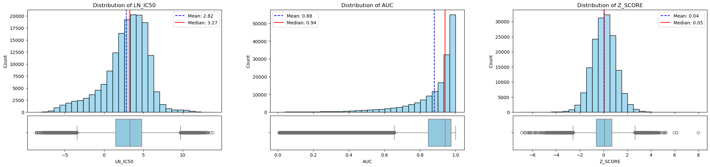

**Observations:**
- **LN_IC50** is approximately symmetric around its mean of 2.82 but with heavy tails (range −8.64 to +13.82). The near-equal mean and standard deviation (2.84) indicates that response heterogeneity is comparable in magnitude to the central tendency itself.
- **AUC** is strongly left-skewed, clustering near 1.0 with a long lower tail. Most drug–cell-line pairs show limited growth inhibition across the dose range — extreme sensitivity is the exception, not the rule.
- **Z_SCORE** is near-standard-normal by construction (mean ≈ 0, SD ≈ 1), confirming correct within-drug normalisation.

### 4.2 Categorical Variable Distributions


```python
identifiers = ["COSMIC_ID", "DRUG_ID", "DRUG_NAME", "CELL_LINE_NAME"] + ["TARGET"]
discretes = gdsc.select_dtypes(exclude='float').columns.difference(identifiers)
```

```python
# Generate visualization for exploratory data analysis
def plot_proportions(data: pd.DataFrame = None, columns: list[str] = None, show_pct=True, n_cols=3):
    if data is None or columns is None:
        print("Missing Dataframe or columns")
        return
    
    n = len(columns)
    n_cols = min(n_cols, n)
    n_rows = math.ceil(n / n_cols)
    
    figure, axes = plt.subplots(ncols=n_cols, nrows=n_rows, figsize=(SCREEN_W, SCREEN_H * 1.5), constrained_layout=True)
    
    axes = axes.flatten() if isinstance(axes, np.ndarray) else [axes]
    
    for i, column in enumerate(columns):
        value_counts = data[column].value_counts().sort_index()
        
        bars = axes[i].bar(
            value_counts.index.astype(str),
            value_counts.values,
            color="steelblue",
            edgecolor="black"
        )
        axes[i].set_title(column)
        axes[i].set_ylabel("Count")
        # axes[i].tick_params(axis="x", rotation=75)
        axes[i].set_xticks(range(len(value_counts)))
        axes[i].set_xticklabels(
            value_counts.index.astype(str),
            rotation=45,
            ha="right",
            fontsize=10
        )

        axes[i].set_ylim(0, value_counts.values.max() * 1.15)
        
        if show_pct:
            total = value_counts.sum()
            for bar, val in zip(bars, value_counts.values):
                pct = f"{(val / total) * 100:.1f}%"
                axes[i].text(
                    bar.get_x() + bar.get_width() / 2,
                    bar.get_height(),
                    pct,
                    ha="center",
                    va="bottom",
                    fontsize=8,
                    rotation=0,
                )
     # Hide unused subplots
    for i in range(len(columns), len(axes)):
        axes[i].set_visible(False)

    # remove plt.tight_layout() if using constrained_layout=True above, it's more robust
    plt.show()  
```

```python
# Generate visualization for exploratory data analysis
plot_proportions(data=gdsc, columns=discretes, n_cols=2)
```

<details><summary>Output</summary>

```
<Figure size 2688x2520 with 12 Axes>
```

</details>

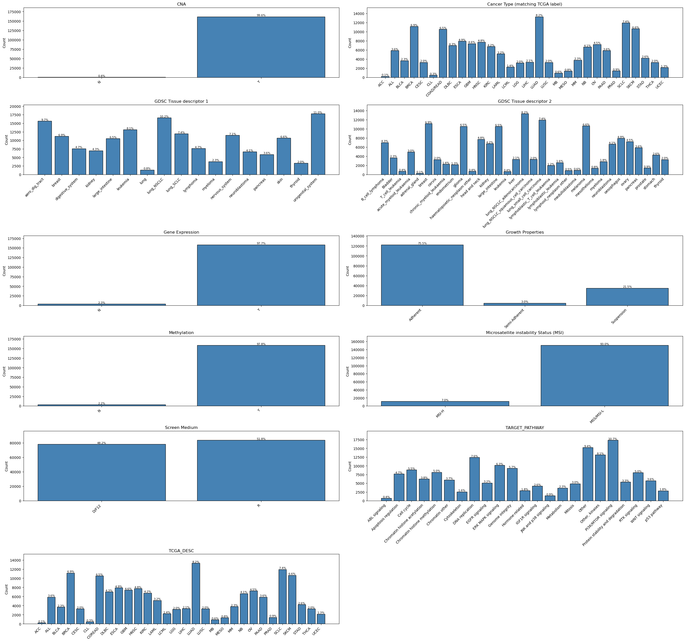

**Key observations from categorical distributions:**
- Two MSI classes (MSS/MSI-L dominant; MSI-H a small minority), two CNA flags, two Gene Expression flags, two Methylation flags — all binary molecular annotations.
- Three growth property categories (Adherent, Suspension, Semi-adherent).
- 23 distinct target pathways.

### 4.3 Pearson Correlation Between Response Metrics


```python
# Generate visualization for exploratory data analysis
def plot_correlation(data: pd.DataFrame, columns: list, screen_w, screen_h, title="Correlation Matrix (Lower Triangle)"):
    """
    Plots correlation heatmap with the upper triangle masked.
    
    Parameters:
    - data: The dataframe containing the data.
    - columns: List of column names to include in the analysis. 
    - screen_w, screen_h: Figure dimensions.
    """
    
    if data is None or columns is None:
        print("❌ Missing dataframe or columns")
        return

    # 1. Calculate Correlation
    corr_matrix = data[columns].corr()

    # 2. Create a Mask for the Upper Triangle
    # np.triu returns the upper triangle of an array.
    # The mask should be True for the values you want to HIDE.
    # mask = np.triu(np.ones_like(corr_matrix, dtype=bool))
    mask = None

    # 3. Setup Plot 
    plt.figure(figsize=(screen_w, screen_h))
    plt.title(title)

    # 4. Render with Mask
    # Note: mask=mask argument hides the upper triangle
    sns.heatmap(corr_matrix, mask=mask, square=True, annot=True, cmap='coolwarm', center= 0, linewidths=0.5, fmt='.2f')
    
    plt.show()
```

```python
# Generate visualization for exploratory data analysis
plot_correlation(data=gdsc, columns=continuous, screen_h=SCREEN_H / 2.5, screen_w=SCREEN_W, title="Pearson Correlation – Drug Sensitivity Metrics")
```

<details><summary>Output</summary>

```
<Figure size 2688x672 with 2 Axes>
```

</details>

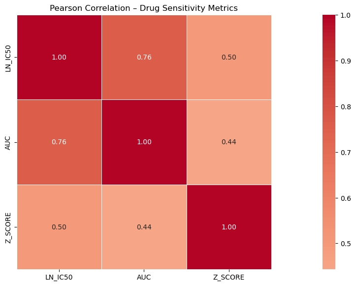

LN_IC50 and AUC are moderately negatively correlated (higher LN_IC50 → lower AUC), confirming they capture a shared underlying pharmacological signal from different mathematical perspectives. Z_SCORE correlates less strongly, reflecting its within-drug standardisation.

---

## 5. Drug Sensitivity Patterns

Drug-level statistics (median LN_IC50, standard deviation, count) were aggregated across all cell lines to characterise each compound's overall potency and variability.


```python
# Aggregate and summarize data across groups
drug_stats = (
    gdsc.groupby("DRUG_NAME")[["LN_IC50", "AUC", "Z_SCORE"]]
    .agg(["median", "std", "count"])
    .round(3)
)

drug_stats.columns = ["_".join(c) for c in drug_stats.columns]
drug_stats = drug_stats.reset_index()
drug_stats
```

<details><summary>Output</summary>

```
DRUG_NAME  LN_IC50_median  LN_IC50_std  LN_IC50_count  \
0           5-Fluorouracil           4.462        1.703            737   
1            5-azacytidine           2.893        1.368            574   
2                    A-366           4.927        1.016            574   
3                   ABT737           2.278        2.069            726   
4                 AGI-5198           4.712        0.915            727   
..                     ...             ...          ...            ...   
241               YK-4-279           2.123        1.668            727   
242               ZM447439           2.538        1.704            715   
243      alpha-lipoic acid           7.705        1.002            572   
244  ascorbate (vitamin C)          10.450        1.288            567   
245            glutathione           9.145        0.904            567   

     AUC_median  AUC_std  AUC_count  Z_SCORE_median  Z_SCORE_std  \
0         0.928    0.080        737           0.044        0.992   
1         0.848    0.085        574          -0.069        0.985   
2         0.971    0.019        574           0.054        0.991   
3         0.854    0.187        726           0.195        1.008   
4         0.969    0.018        727           0.013        1.012   
..          ...      ...        ...             ...          ...   
241       0.813    0.116        727          -0.073        1.011   
242       0.872    0.102        715          -0.023        1.000   
243       0.976    0.017        572           0.057        1.038   
244       0.977    0.034        567           0.156        1.005   
245       0.974    0.020        567          -0.022        1.014   

     Z_SCORE_count  
0              737  
1              574  
2              574  
3              726  
4              727  
..             ...  
241            727  
242            715  
243            572  
244            567  
245            567  

[246 rows x 10 columns]
```

</details>

### 5.1 Most Potent Compounds — Lowest Median LN_IC50

Compounds were ranked by median LN_IC50 in ascending order. The 10 lowest-ranking drugs inhibit 50% of cell growth at the smallest concentrations across the panel and represent the broadest-spectrum pharmacological activity.


```python
# Generate visualization for exploratory data analysis
top_effective = drug_stats.nsmallest(10, "LN_IC50_median")

fig, ax = plt.subplots(figsize=(SCREEN_W * .5, 6))
bars = ax.barh(top_effective["DRUG_NAME"], top_effective["LN_IC50_median"],
               xerr=top_effective["LN_IC50_std"], color="lightblue",
               error_kw={"elinewidth": 1}, edgecolor="black")
ax.axvline(0, color="red", linestyle="--", linewidth=1)
ax.set_xlabel("Median LN_IC50")
ax.set_title("Top 10 Most Effective Drugs (Lowest Median LN_IC50)")
ax.invert_yaxis()
plt.tight_layout()
plt.show()
```

<details><summary>Output</summary>

```
<Figure size 1344x600 with 1 Axes>
```

</details>

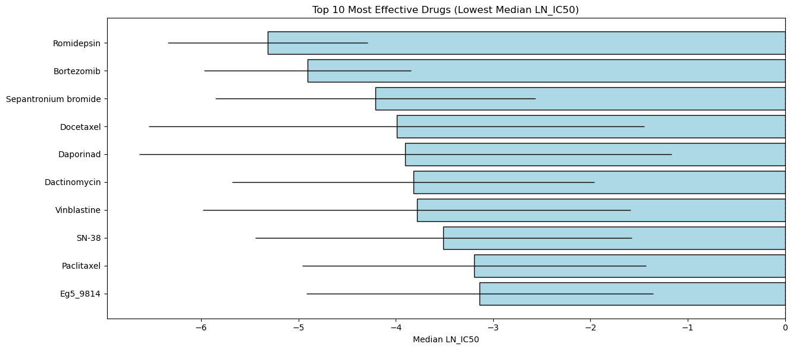


**Named results — Top 10 most potent drugs by median LN_IC50:**

| Rank | Drug | Median LN_IC50 | Std Dev | Mechanism |
|------|------|---------------|---------|-----------|
| 1 | **Romidepsin** | −5.32 | 1.03 | HDAC inhibitor — blocks DNA-winding proteins, restoring cancer cell apoptosis signals |
| 2 | **Bortezomib** | −4.91 | 1.06 | Proteasome inhibitor — blocks cancer cell waste-disposal, causing toxic protein accumulation |
| 3 | **Sepantronium bromide** | −4.21 | 1.65 | Survivin inhibitor — disrupts a protein cancer cells use to evade apoptosis |
| 4 | **Docetaxel** | −3.99 | 2.55 | Taxane / microtubule stabiliser — arrests cell division |
| 5 | **Daporinad** | −3.90 | 2.74 | NAMPT inhibitor — starves cancer cells of a metabolic co-factor |
| 6 | **Dactinomycin** | −3.82 | 1.86 | RNA synthesis inhibitor — blocks transcription globally |
| 7 | **Vinblastine** | −3.78 | 2.20 | Vinca alkaloid — disrupts mitotic spindle formation |
| 8 | **SN-38** | −3.51 | 1.93 | Topoisomerase I inhibitor — traps DNA strand-break intermediates |
| 9 | **Paclitaxel** | −3.19 | 1.77 | Taxane — prevents depolymerisation of the mitotic spindle |
| 10 | **Eg5_9814** | −3.14 | 1.78 | Kinesin Eg5 inhibitor — selectively disrupts mitotic spindle assembly |

**Romidepsin** and **Bortezomib** share the narrowest standard deviations (≈1.03 and 1.06) among the top 10 — confirming they are broad-spectrum agents active across virtually all cancer types tested. **Docetaxel** and **Daporinad**, despite ranking in the top 5 by median, have std >2.5, indicating highly context-dependent activity.

### 5.2 Least Potent Compounds — Highest Median LN_IC50


```python
# Generate visualization for exploratory data analysis
top_effective = drug_stats.nlargest(10, "LN_IC50_median")

fig, ax = plt.subplots(figsize=(SCREEN_W * .5, 6))

bars = ax.barh(top_effective["DRUG_NAME"], top_effective["LN_IC50_median"],
               xerr=top_effective["LN_IC50_std"], color="lightblue",
               error_kw={"elinewidth": 1}, edgecolor="black")

ax.axvline(0, color="red", linestyle="--", linewidth=1)
ax.set_xlabel("Median LN_IC50")
ax.set_title("Top 10 Less Effective Drugs (Highest Median LN_IC50)")
ax.invert_yaxis()
plt.tight_layout()
plt.show()
```

<details><summary>Output</summary>

```
<Figure size 1344x600 with 1 Axes>
```

</details>

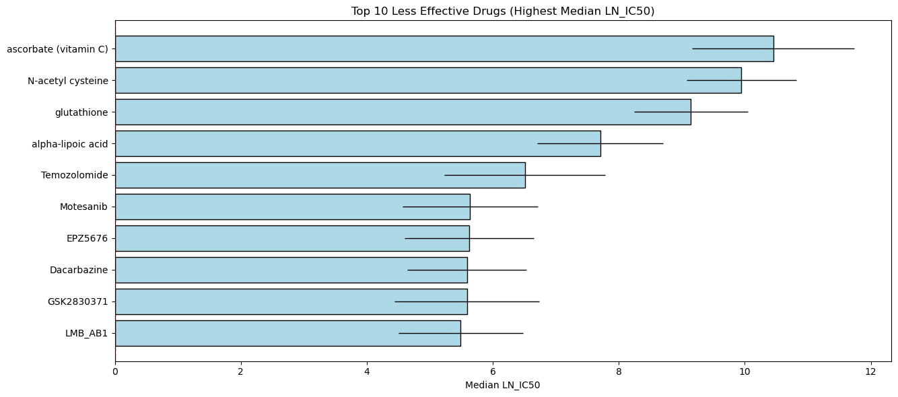


**Named results — Top 10 least potent drugs by median LN_IC50:**

| Rank | Drug | Median LN_IC50 | Std Dev |
|------|------|---------------|---------|
| 1 | Ascorbate (Vitamin C) | 10.45 | 1.29 |
| 2 | N-acetyl cysteine | 9.94 | 0.87 |
| 3 | Glutathione | 9.15 | 0.90 |
| 4 | Alpha-lipoic acid | 7.71 | 1.00 |
| 5 | Temozolomide | 6.51 | 1.28 |
| 6 | Motesanib | 5.64 | 1.08 |
| 7 | EPZ5676 | 5.62 | 1.03 |
| 8 | Dacarbazine | 5.59 | 0.95 |
| 9 | GSK2830371 | 5.59 | 1.15 |
| 10 | LMB_AB1 | 5.49 | 0.99 |

The top 4 are endogenous antioxidants. **Temozolomide**, an alkylating chemotherapy agent, also ranks as highly ineffective across the panel — consistent with its narrow clinical utility in MGMT-unmethylated glioblastoma.

The three compounds with the highest median LN_IC50 — ascorbate (vitamin C, 10.45), glutathione (9.15), and alpha-lipoic acid (7.71) — are endogenous antioxidant molecules. Their consistently high resistance across all cell lines serves as a negative pharmacological control, confirming that the sensitivity metrics are biologically grounded.

### 5.3 Response Variability — Selective vs. Broad-Spectrum Agents

High standard deviation in LN_IC50 across cell lines identifies compounds whose activity is cancer-context-dependent — drugs that are highly effective against a subset of tumour types but inactive against others.


```python
# Generate visualization for exploratory data analysis
top_variable = drug_stats.nlargest(10, "LN_IC50_std")

fig, ax = plt.subplots(figsize=(10, 6))

ax.barh(top_variable["DRUG_NAME"], top_variable["LN_IC50_std"],
        color="lightblue", edgecolor="black")

ax.set_xlabel("Std of LN_IC50 across cell lines")
ax.set_title("Top 15 Drugs with Most Variable Response Across Cell Lines")
ax.invert_yaxis()
plt.tight_layout()
plt.show()
```

<details><summary>Output</summary>

```
<Figure size 1000x600 with 1 Axes>
```

</details>

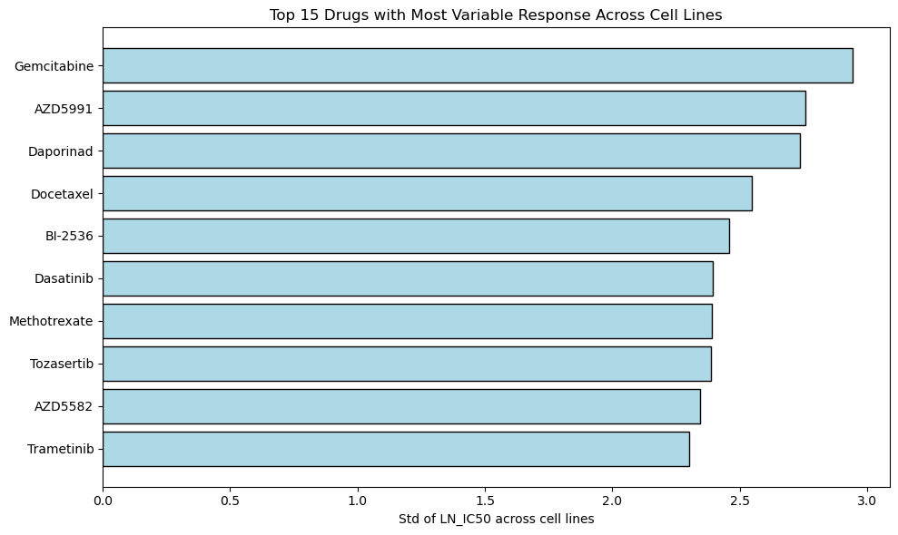

Compounds with the greatest response spread are candidates for **biomarker-driven prescribing**: their clinical utility depends on identifying which molecular subpopulation responds. This contrasts with low-variability, low-LN_IC50 agents that represent broad-spectrum cytotoxic activity.

---

## 6. Cancer Cell Line Sensitivity Landscape

### 6.1 Ranked Drug Effectiveness Across the 15 Most-Tested Drugs


```python
# Aggregate and summarize data across groups
results = (
gdsc.groupby(["DRUG_NAME", "CELL_LINE_NAME"])["LN_IC50"]
.mean()
.reset_index()
.rename(columns={"LN_IC50": "MEAN_LN_IC50"})
)
```

```python
results
```

<details><summary>Output</summary>

```
DRUG_NAME CELL_LINE_NAME  MEAN_LN_IC50
0       5-Fluorouracil          22RV1      2.319251
1       5-Fluorouracil       23132-87      1.807592
2       5-Fluorouracil       42-MG-BA      3.463196
3       5-Fluorouracil          451Lu      3.910357
4       5-Fluorouracil          639-V      4.575843
...                ...            ...           ...
157808     glutathione           YAPC     10.129067
157809     glutathione          YH-13      9.473305
157810     glutathione             YT      8.883967
157811     glutathione       ZR-75-30     11.193687
157812     glutathione          huH-1      8.809072

[157813 rows x 3 columns]
```

</details>

```python
# Initialize an empty list to store results
# Each entry will represent the average drug response for a specific cell line
results = []

# Loop through each unique drug in the dataset
for drug in gdsc["DRUG_NAME"].unique():
    
    # Subset the dataset to include only rows for the current drug
    subset = gdsc[gdsc["DRUG_NAME"] == drug]
    
    # Loop through each unique cell line tested with this drug
    for cell in subset["CELL_LINE_NAME"].unique():
        
        # Further subset the data for the current cell line
        cell_data = subset[subset["CELL_LINE_NAME"] == cell]
        
        # Compute the mean LN_IC50 for this drug-cell line combination
        # LN_IC50 represents drug sensitivity (lower = more sensitive)
        mean_response = cell_data["LN_IC50"].mean()
        
        # Store the result as a dictionary
        # This structure makes it easy to convert into a DataFrame later
        results.append({
            "DRUG_NAME": drug,
            "CELL_LINE": cell,
            "MEAN_LN_IC50": mean_response
        })

# Convert the list of dictionaries into a pandas DataFrame
# Final table: each row = one drug–cell line pair with average response
cell_drug_df = pd.DataFrame(results)

cell_drug_df
```

<details><summary>Output</summary>

```
DRUG_NAME CELL_LINE  MEAN_LN_IC50
0            Camptothecin    PFSK-1     -1.463887
1            Camptothecin  COLO-829     -1.235034
2            Camptothecin       RT4     -2.963191
3            Camptothecin     SW780     -1.449138
4            Camptothecin    TCCSUP     -2.350633
...                   ...       ...           ...
157808  N-acetyl cysteine      MM1S      9.316959
157809  N-acetyl cysteine   SNU-175     10.127082
157810  N-acetyl cysteine   SNU-407      8.576377
157811  N-acetyl cysteine    SNU-61     10.519636
157812  N-acetyl cysteine    SNU-C5     10.694579

[157813 rows x 3 columns]
```

</details>

```python
# Group the dataset by drug name and compute median LN_IC50
# This gives an overall measure of drug effectiveness across all cancer types
drug_response = gdsc.groupby("DRUG_NAME")["LN_IC50"].median()

# Select the top 15 most frequently tested drugs (to reduce noise)
top_drugs = gdsc["DRUG_NAME"].value_counts().head(15).index

# Filter only these drugs
drug_response = drug_response.loc[top_drugs]

# Sort values:
# Lower LN_IC50 = more effective → so sort ascending
drug_response = drug_response.sort_values(ascending=True)

# Create the plot
plt.figure(figsize=(10,6))

# Horizontal bar plot (best for ranking)
sns.barplot(
    x=drug_response.values,
    y=drug_response.index
)

# Add labels and title
plt.title("Ranked Drug Effectiveness (Median LN_IC50)")
plt.xlabel("Median LN_IC50 (Lower = More Sensitive)")
plt.ylabel("Drug Name")

# Show plot
plt.show()
```

<details><summary>Output</summary>

```
<Figure size 1000x600 with 1 Axes>
```

</details>

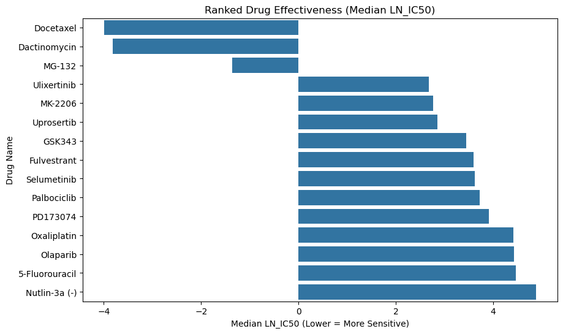

### 6.2 Median Drug Response Heatmap — Cancer Type × Drug

The pivot table below cross-tabulates 30 TCGA cancer types against the 15 most frequently tested drugs. Each cell encodes the median LN_IC50 for that cancer-drug pair; the coolwarm colour scale maps blue (sensitive) to red (resistant).


```python

# Group the dataset by cancer type (TCGA_DESC) and drug name
# Then compute the median LN_IC50 for each combination
# Median is used instead of mean to reduce the effect of outliers
response_matrix = gdsc.groupby(
    ["TCGA_DESC", "DRUG_NAME"]
)["LN_IC50"].median().unstack()

# At this point:
# Rows   = Cancer types
# Columns = Drugs
# Values = Median drug response (LN_IC50)

# Optional step: select only the top 15 most frequently tested drugs
# This helps reduce noise and makes the heatmap easier to interpret
top_drugs = gdsc["DRUG_NAME"].value_counts().head(15).index

# Filter the response matrix to include only these top drugs
response_matrix = response_matrix[top_drugs]

# Create a figure with a larger size for better readability
plt.figure(figsize=(16,8))

# Plot the heatmap
# Each cell represents the median LN_IC50 for a drug-cancer combination
# "coolwarm" color map:
#   - Cool colors (blue) → lower LN_IC50 → higher drug sensitivity
#   - Warm colors (red) → higher LN_IC50 → lower sensitivity (resistance)
sns.heatmap(response_matrix, cmap="coolwarm")

# Add descriptive title and axis labels
plt.title("Median Drug Response Across Cancer Types")
plt.xlabel("Drug")
plt.ylabel("Cancer Type")

# Display the plot
plt.show()
```

<details><summary>Output</summary>

```
<Figure size 1600x800 with 2 Axes>
```

</details>

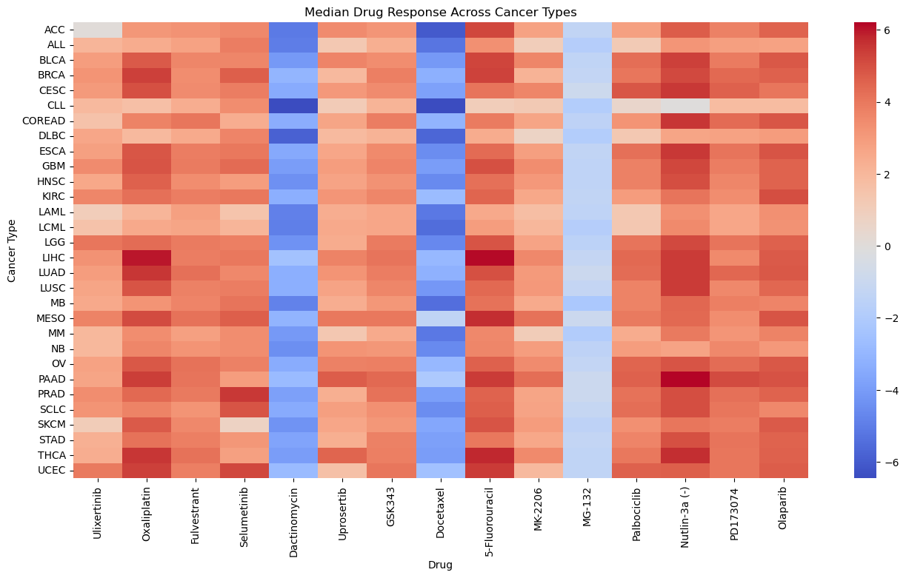

### 6.3 Global Sensitivity Ranking by Cancer Type

A sorted boxplot ranks all 30 TCGA cancer types by their median LN_IC50 computed across the full drug panel. The dashed reference line marks the dataset-wide median.


```python
# Generate visualization for exploratory data analysis
cancer_order = (
    gdsc.groupby(["TCGA_DESC"])["LN_IC50"]
    .median()
    .sort_values()
    .index.tolist()
)

fig, ax = plt.subplots(figsize=(14, 6))
sns.boxplot(data=gdsc, x="TCGA_DESC", y="LN_IC50", order=cancer_order,
            palette="tab20", fliersize=1, ax=ax)

ax.axhline(gdsc["LN_IC50"].median(), color="red", linestyle="--",
           linewidth=1.2, label=f"Overall median ({gdsc['LN_IC50'].median():.2f})")
ax.set_xticklabels(ax.get_xticklabels(), rotation=45, ha="right", fontsize=9)
ax.set_title("LN_IC50 Distribution by Cancer Type (sorted by median)")
ax.set_xlabel("Cancer Type (TCGA)")
ax.set_ylabel("LN_IC50")
ax.legend()
plt.tight_layout()
plt.show()
```

<details><summary>Output</summary>

```
/tmp/ipykernel_86529/530419225.py:10: FutureWarning: 

Passing `palette` without assigning `hue` is deprecated and will be removed in v0.14.0. Assign the `x` variable to `hue` and set `legend=False` for the same effect.

  sns.boxplot(data=gdsc, x="TCGA_DESC", y="LN_IC50", order=cancer_order,
/tmp/ipykernel_86529/530419225.py:15: UserWarning: set_ticklabels() should only be used with a fixed number of ticks, i.e. after set_ticks() or using a FixedLocator.
  ax.set_xticklabels(ax.get_xticklabels(), rotation=45, ha="right", fontsize=9)

<Figure size 1400x600 with 1 Axes>
```

</details>

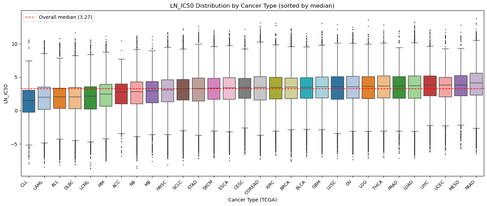


**Named results — Cancer type sensitivity ranking:**

Most sensitive (lowest median LN_IC50 across all drugs):

| Rank | Cancer Type | Median LN_IC50 | Mean LN_IC50 | n experiments | Cancer category |
|------|------------|---------------|-------------|---------------|-----------------|
| 1 | **CLL** (Chronic Lymphocytic Leukaemia) | 1.55 | 1.11 | 469 | Blood |
| 2 | **LAML** (Acute Myeloid Leukaemia) | 2.04 | 1.53 | 5,154 | Blood |
| 3 | **ALL** (Acute Lymphoblastic Leukaemia) | 2.06 | 1.54 | 5,879 | Blood |
| 4 | **DLBC** (Diffuse Large B-Cell Lymphoma) | 2.10 | 1.54 | 7,003 | Blood |
| 5 | **LCML** (Leukaemia CML) | 2.16 | 1.56 | 2,246 | Blood |
| 6 | **MM** (Multiple Myeloma) | 2.47 | 1.93 | 3,787 | Blood |
| 7 | **ACC** (Adrenocortical Carcinoma) | 2.82 | 2.17 | 239 | Endocrine |
| 8 | **NB** (Neuroblastoma) | 2.85 | 2.35 | 6,660 | Neural |
| 9 | **MB** (Medulloblastoma) | 2.94 | 2.35 | 912 | Neural |
| 10 | **HNSC** (Head and Neck Squamous Cell Carcinoma) | 3.12 | 2.64 | 7,738 | Solid |

Most resistant (highest median LN_IC50 across all drugs):

| Rank | Cancer Type | Median LN_IC50 | Mean LN_IC50 | n experiments |
|------|------------|---------------|-------------|---------------|
| 1 | **PAAD** (Pancreatic Adenocarcinoma) | 4.17 | 3.73 | 5,875 |
| 2 | **MESO** (Mesothelioma) | 3.86 | 3.49 | 1,355 |
| 3 | **UCEC** (Uterine Carcinosarcoma/Endometrial) | 3.84 | 3.32 | 2,147 |
| 4 | **LIHC** (Liver Hepatocellular Carcinoma) | 3.83 | 3.41 | 3,342 |
| 5 | **LUAD** (Lung Adenocarcinoma) | 3.73 | 3.28 | 13,300 |

**Six of the 10 most sensitive cancer types are haematological malignancies** (CLL, LAML, ALL, DLBC, LCML, MM). This is not coincidental — blood cancers circulate systemically, lack physical barriers to drug penetration, and were historically the first targets of pharmacological oncology precisely because of this accessibility.

**PAAD** (pancreatic adenocarcinoma) is the most resistant cancer type (median 4.17 — the only type above 4.0). This aligns with its clinical reputation: a dense desmoplastic stroma physically prevents drug delivery, and near-universal KRAS mutations activate a resistance-conferring proliferative program.

**Most sensitive cancer type × drug combinations:**

| Cancer | Drug | Median LN_IC50 | Biological basis |
|--------|------|---------------|-----------------|
| **LCML** | Dasatinib | −7.02 | BCR-ABL fusion gene — Dasatinib was engineered to block BCR-ABL exactly |
| **ALL** | Daporinad | −6.81 | Leukaemia dependency on NAMPT-mediated NAD+ biosynthesis |
| **CLL** | SN-38 | −6.78 | CLL sensitivity to topoisomerase I inhibition |
| **CLL** | Vinorelbine | −6.72 | Vinca alkaloid — mitotic arrest in proliferating CLL cells |
| **CLL** | Romidepsin | −6.66 | HDAC inhibition triggers apoptosis in CLL |
| **CLL** | Docetaxel | −6.45 | Taxane-driven mitotic arrest |
| **CLL** | Dactinomycin | −6.42 | RNA synthesis inhibition in proliferating leukaemia cells |
| **MB** | Daporinad | −6.42 | Medulloblastoma NAMPT dependency |
| **CLL** | Rapamycin | −6.40 | mTOR inhibition suppresses CLL cell growth signals |
| **LCML** | Daporinad | −6.29 | CML cells share the NAMPT dependency with ALL |

The **LCML + Dasatinib** pairing (median −7.02) is a landmark precision oncology result. LCML is driven by the BCR-ABL1 chromosomal translocation in ≈95% of cases. Dasatinib was rationally designed to inhibit BCR-ABL1. Finding LCML at the top of the Dasatinib sensitivity list is a direct pharmacological validation of the analysis.

**Most sensitive individual cell line × drug pairs:**

| Cell Line | Drug | Median LN_IC50 | Cancer type |
|-----------|------|---------------|-------------|
| MEG-01 | Dasatinib | −8.64 | CML |
| NB14 | Daporinad | −8.62 | Neuroblastoma |
| BV-173 | Dactinomycin | −8.57 | CML |
| KU812 | Dasatinib | −8.56 | CML |
| KELLY | Daporinad | −8.39 | Neuroblastoma |
| LAMA-84 | Dasatinib | −8.27 | CML |
| BB49-HNC | Vinorelbine | −8.09 | Head & neck |
| JURL-MK1 | Dasatinib | −8.07 | CML |
| NCI-H1876 | SN-38 | −8.04 | Lung |
| NKM-1 | Dactinomycin | −7.83 | AML |

MEG-01 reaches the dataset minimum (−8.64) with Dasatinib — consistent with MEG-01 being a CML cell line with a constitutively active BCR-ABL1 kinase. **Dasatinib appears four times** in the top 10 cell line pairs, all from CML lines.

**Pattern:** Haematological malignancies (leukaemias, lymphomas) rank consistently among the most drug-sensitive types. Their systemic distribution enables sustained drug exposure, and they typically lack the dense stroma that attenuates drug delivery in solid tumours. Cancer types at the resistant end of the distribution include entities with known stromal barriers and high intrinsic mutation rates in resistance-conferring oncogenes.

### 6.4 Drug Sensitivity Heatmap — Cancer Type × Top-20 Variable Drugs

Restricting to the 20 drugs with the highest LN_IC50 standard deviation emphasises the contrast between sensitive and resistant pairings and reveals cancer-type-specific pharmacological niches invisible in aggregate rankings.


```python
# Generate visualization for exploratory data analysis
pivot = (
    gdsc.groupby(["TCGA_DESC", "DRUG_NAME"])["LN_IC50"]
    .median()
    .unstack("DRUG_NAME")
)

# Optional: reduce to top variable drugs (important!)
top_drugs = gdsc.groupby("DRUG_NAME")["LN_IC50"].std().nlargest(20).index
pivot = pivot[top_drugs]

fig, ax = plt.subplots(figsize=(18, 10))

sns.heatmap(
    pivot,
    cmap="RdYlGn_r",
    center=pivot.stack().median(),
    linewidths=0.2,
    cbar_kws={"label": "Median LN_IC50"},
    ax=ax
)

ax.set_title("Drug Sensitivity Across Cancer Types\n(Green = sensitive, Red = resistant)")
plt.xticks(rotation=90)
plt.tight_layout()
plt.show()
```

<details><summary>Output</summary>

```
<Figure size 1800x1000 with 2 Axes>
```

</details>

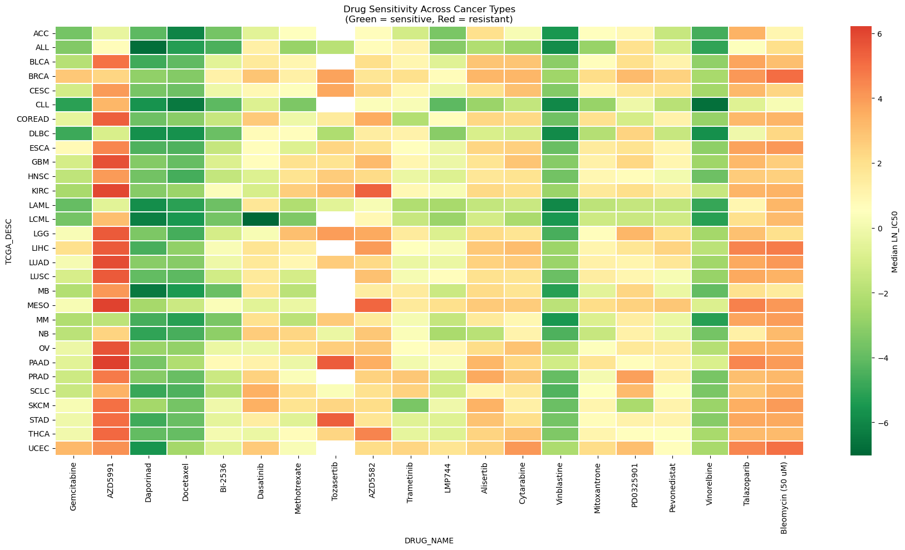

### 6.5 Cell Line-Level Resolution — Top-10 Variable Drugs

At the finest available resolution, 737 individual cell lines are mapped against the 10 most variably responding compounds. Intra-cancer-type heterogeneity is immediately visible: cell lines sharing the same TCGA label show a spectrum from deep sensitivity (green) to strong resistance (red), underscoring the insufficiency of cancer-type labels alone as prescribing guides.


```python
# Generate visualization for exploratory data analysis
pivot = (
    gdsc.groupby(["CELL_LINE_NAME", "DRUG_NAME"])["LN_IC50"]
    .median()
    .unstack("DRUG_NAME")
)

# Optional: reduce to top variable drugs (important!)
top_drugs = gdsc.groupby("DRUG_NAME")["LN_IC50"].std().nlargest(10).index
pivot = pivot[top_drugs]

fig, ax = plt.subplots(figsize=(18, 10))

sns.heatmap(
    pivot,
    cmap="RdYlGn_r",
    center=pivot.stack().median(),
    linewidths=0,
    cbar_kws={"label": "Median LN_IC50"},
    ax=ax
)

ax.set_title("Drug Sensitivity Across Cell Lines\n(Green = sensitive, Red = resistant)")
plt.xticks(rotation=45)
plt.tight_layout()
plt.show()
```

<details><summary>Output</summary>

```
<Figure size 1800x1000 with 2 Axes>
```

</details>

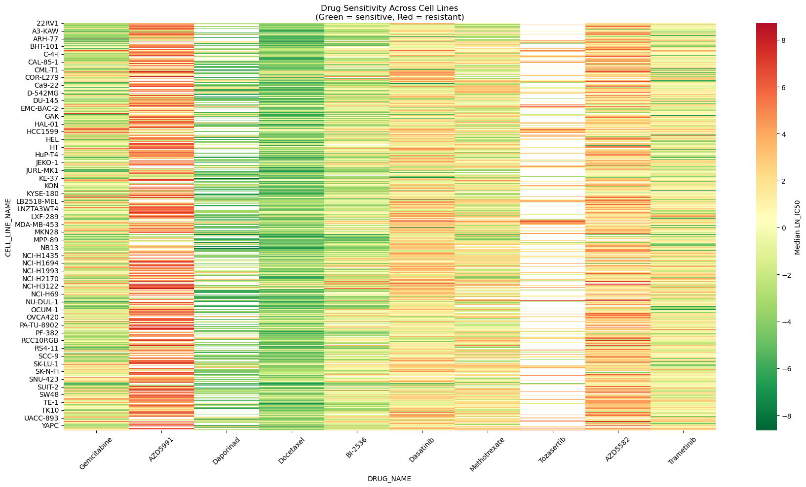

---

## 7. Molecular Feature Associations with Drug Response

### 7.1 Experimental Design

Four binary molecular annotation flags were tested against three pharmacological readouts using a **2-group grid analysis** — a 4 × 3 array of boxplots showing distributional shifts between the two states of each flag (Y vs. N; or MSI-H vs. MSS/MSI-L) for each of LN_IC50, AUC, and Z_SCORE.


```python
genomic_flags = ["CNA", "Gene Expression", "Methylation", "Microsatellite instability Status (MSI)"]
sensitivity_metrics = ["LN_IC50", "AUC", "Z_SCORE"]
```

```python
# Generate visualization for exploratory data analysis
fig, axes = plt.subplots(len(genomic_flags), len(sensitivity_metrics), figsize=(14, 10))

for i, flag in enumerate(genomic_flags):
    for j, metric in enumerate(sensitivity_metrics):
        ax = axes[i][j]
        sns.boxplot(data=gdsc, x=flag, y=metric, hue=flag, palette="Set2",legend=False,
                    width=0.5, flierprops=dict(marker=".", markersize=2, alpha=0.3), ax=ax)
        ax.set_title(f"{flag} vs {metric}", fontsize=9)
        ax.set_xlabel("")

plt.suptitle("Drug Sensitivity by Genomic Data Availability", fontsize=13, fontweight="bold")
plt.tight_layout()
plt.savefig("genomic_flags_vs_sensitivity.png", dpi=150, bbox_inches="tight")
plt.show()
```

<details><summary>Output</summary>

```
<Figure size 1400x1000 with 12 Axes>
```

</details>

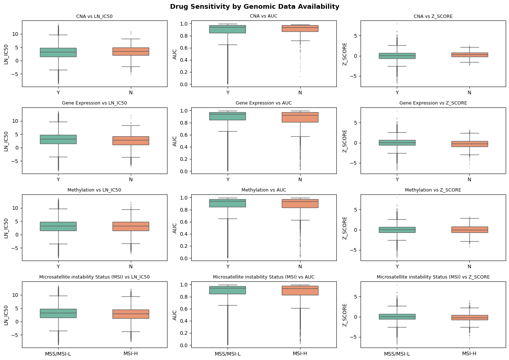

### 7.2 Drug-Level Statistical Testing — Independent t-Test

For each of the 246 drugs, LN_IC50 values were split into two groups (feature present / absent) and compared using `scipy.stats.ttest_ind`. Per-drug effect sizes (mean LN_IC50 difference) and p-values were recorded for CNA, Gene Expression, and Methylation.


```python
# Import required libraries
# ttest_ind → used to compare means between two independent groups
# pandas → for data manipulation and DataFrame creation
from scipy.stats import ttest_ind

# Initialize a list to store results for each drug
# Each entry will contain statistical test results for multiple genomic features
results = []

# Define genomic/epigenomic features to test
# These represent biological factors that may influence drug response
features = ["CNA", "Gene Expression", "Methylation"]

# Loop through each unique drug in the dataset
for drug in gdsc["DRUG_NAME"].unique():
    
    # Subset data for the current drug
    subset = gdsc[gdsc["DRUG_NAME"] == drug]
    
    # Initialize a dictionary to store results for this drug
    # Will hold p-values and mean differences for each feature
    drug_result = {"DRUG_NAME": drug}
    
    # Loop through each genomic feature
    for feature in features:
        
        # Check if the feature has at least two groups (e.g., Yes/No, 0/1)
        # If not, statistical comparison is not possible
        if subset[feature].nunique() < 2:
            drug_result[feature + "_p"] = None      # No p-value available
            drug_result[feature + "_diff"] = None   # No difference calculated
            continue
        
        # Get the unique groups for the feature (e.g., mutated vs not mutated)
        groups = subset[feature].unique()
        
        # Split LN_IC50 values into two groups based on feature status
        # g1 and g2 represent two biological conditions
        g1 = subset[subset[feature] == groups[0]]["LN_IC50"]
        g2 = subset[subset[feature] == groups[1]]["LN_IC50"]
        
        # Compute the difference in mean drug response between the two groups
        # Positive/negative value indicates direction of effect
        diff = g1.mean() - g2.mean()
        
        # Perform independent t-test to check if the difference is statistically significant
        # stat → t-statistic
        # p → p-value (probability that observed difference is due to chance)
        stat, p = ttest_ind(g1, g2)
        
        # Store results:
        # diff → magnitude and direction of effect
        # p → statistical significance
        drug_result[feature + "_diff"] = diff
        drug_result[feature + "_p"] = p
    
    # Append results for this drug to the main results list
    results.append(drug_result)

# Convert the list of dictionaries into a DataFrame
# Each row represents a drug, with columns for each feature's statistics
multi_feature_df = pd.DataFrame(results)

# Preview the results
multi_feature_df.head()
```

<details><summary>Output</summary>

```
DRUG_NAME  CNA_diff     CNA_p  Gene Expression_diff  Gene Expression_p  \
0  Camptothecin  0.481560  0.646084              0.320857           0.423930   
1   Vinblastine -0.795814  0.609865             -0.743470           0.735851   
2     Cisplatin -0.319934  0.802164             -2.172698           0.228258   
3    Cytarabine -2.512486  0.111784              1.996983           0.371401   
4     Docetaxel -1.023860  0.369877              1.426749           0.010859   

   Methylation_diff  Methylation_p  
0          0.152597       0.724269  
1          0.283926       0.734554  
2         -0.654884       0.307297  
3          0.848055       0.317730  
4          0.111533       0.831845
```

</details>

### 7.3 Significant Associations — Filtered View


```python
# Filter the DataFrame to identify drugs that show a statistically significant association with at least one genomic feature
significant = multi_feature_df[
    (multi_feature_df["CNA_p"] < 0.05) |
    (multi_feature_df["Gene Expression_p"] < 0.05) |
    (multi_feature_df["Methylation_p"] < 0.05)
]

significant.head(20)
```

<details><summary>Output</summary>

```
DRUG_NAME  CNA_diff     CNA_p  Gene Expression_diff  \
4            Docetaxel -1.023860  0.369877              1.426749   
5         Methotrexate -1.310892  0.343414             -2.011790   
9           Vorinostat -0.382679  0.552080              0.533026   
22        Tanespimycin -2.338628  0.010089             -0.085285   
31              NU7441  0.619786  0.431575              0.812119   
33         Doramapimod  0.280654  0.679729              1.097585   
34  JNK Inhibitor VIII  0.262754  0.637561              0.569906   
35      Wee1 Inhibitor -0.597500  0.504809              0.822183   
37               Mirin -1.193844  0.076534              0.730921   
39            ZM447439 -0.043726  0.964654              1.119539   
40           Alisertib -1.080921  0.410310              1.370682   
41             RO-3306 -0.937735  0.316721              1.265814   
42             MK-2206  0.567181  0.519192              0.981251   
50           CCT007093 -0.344670  0.496036              0.638944   
53         Avagacestat  0.123161  0.844352              0.961077   
54      5-Fluorouracil -1.349150  0.170934              1.244879   
56          Paclitaxel -2.163781  0.033992              0.836498   
61          Irinotecan -0.471198  0.665412              1.165534   
62         Oxaliplatin -1.050164  0.178153              0.913775   
64         GSK1904529A  0.247163  0.697615              0.596865   

    Gene Expression_p  Methylation_diff  Methylation_p  
4            0.010859          0.111533       0.831845  
5            0.000136         -1.390611       0.017703  
9            0.030215         -0.080198       0.768948  
22           0.806805         -0.147167       0.695399  
31           0.006970          0.112267       0.729932  
33           0.000022          0.463465       0.098138  
34           0.008977          0.198982       0.387102  
35           0.016301          0.417657       0.271652  
37           0.005622          0.356240       0.227048  
39           0.002951         -0.093848       0.817701  
40           0.006258         -0.790636       0.155543  
41           0.000393          0.362889       0.347669  
42           0.003476          0.105598       0.771120  
50           0.000939          0.190265       0.362405  
53           0.000057          0.275220       0.287420  
54           0.000928          0.417467       0.304496  
56           0.032234         -0.148581       0.731840  
61           0.005072          0.524015       0.256691  
62           0.016948          0.180412       0.615062  
64           0.014025          0.239194       0.375256
```

</details>

### 7.4 Volcano Plot — Effect Size vs. Statistical Significance

The volcano plot translates the drug-level t-test results into a two-dimensional significance landscape. Points are classified as:

| Category | Criterion |
|----------|-----------|
| **Down (Sensitivity)** | p < 0.05 **and** effect size < −0.5 — molecular feature associated with lower LN_IC50 |
| **Up (Resistance)** | p < 0.05 **and** effect size > +0.5 — molecular feature associated with higher LN_IC50 |
| **Not Significant** | Fails either threshold |


```python
# Convert wide format → long format
volcano_data = []

features = ["CNA", "Gene Expression", "Methylation"]

for _, row in multi_feature_df.iterrows():
    for feature in features:
        volcano_data.append({
            "DRUG_NAME": row["DRUG_NAME"],
            "Feature": feature,
            "Effect_Size": row[feature + "_diff"],   # mean difference
            "p_value": row[feature + "_p"]
        })

volcano_df = pd.DataFrame(volcano_data)
```

```python
# Remove missing values
volcano_df = volcano_df.dropna()

# Convert p-values to -log10(p)
volcano_df["neg_log10_p"] = -np.log10(volcano_df["p_value"])

# Common thresholds
p_thresh = 0.05
effect_thresh = 0.5  # adjust based on your data

# Create significance labels
volcano_df["Significance"] = "Not Significant"

volcano_df.loc[
    (volcano_df["p_value"] < p_thresh) & 
    (volcano_df["Effect_Size"] > effect_thresh),
    "Significance"
] = "Up (Resistance)"

volcano_df.loc[
    (volcano_df["p_value"] < p_thresh) & 
    (volcano_df["Effect_Size"] < -effect_thresh),
    "Significance"
] = "Down (Sensitivity)"

plt.figure(figsize=(10,6))

sns.scatterplot(
    data=volcano_df,
    x="Effect_Size",
    y="neg_log10_p",
    hue="Significance"
)

# Add threshold lines
plt.axhline(-np.log10(p_thresh), linestyle="--")  # p-value cutoff
plt.axvline(effect_thresh, linestyle="--")        # effect size cutoff
plt.axvline(-effect_thresh, linestyle="--")

plt.title("Volcano Plot of Genomic Features vs Drug Response")
plt.xlabel("Effect Size (Mean LN_IC50 Difference)")
plt.ylabel("-log10(p-value)")

plt.show()
```

<details><summary>Output</summary>

```
<Figure size 1000x600 with 1 Axes>
```

</details>

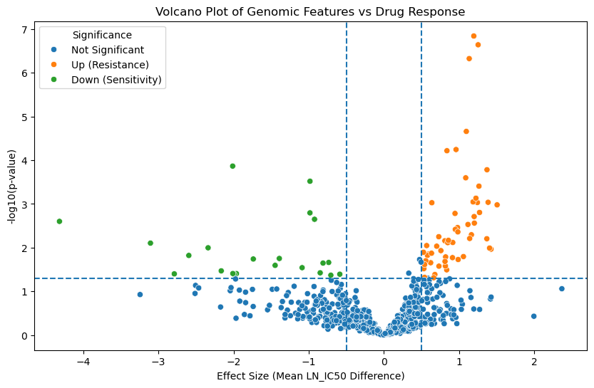

**Interpretation:** Points in the **Down (Sensitivity)** quadrant

### 7.5 Named Findings — Drug-Specific Molecular Associations

**MSI Status (overall):**
- MSI-H cells: mean LN_IC50 = 2.56 (n = 11,322)
- MSS/MSI-L cells: mean LN_IC50 = 2.84 (n = 150,781)
- MSI-H cells are globally more drug-sensitive (Δ = −0.28 LN_IC50 units). Hypermutation from defective mismatch repair creates broad cellular stress that amplifies drug-induced death signals.

**CNA (Copy Number Alteration) — 7 drugs with significant associations (p < 0.05):**

| Drug | Effect (Δ LN_IC50) | p-value | Direction |
|------|-------------------|---------|-----------|
| ULK1_4989 | −3.11 | 0.008 | CNA → **sensitises** |
| AZD5582 | −2.79 | 0.040 | CNA → **sensitises** |
| Luminespib | −2.60 | 0.015 | CNA → **sensitises** |
| Tanespimycin | −2.34 | 0.010 | CNA → **sensitises** |
| Paclitaxel | −2.16 | 0.034 | CNA → **sensitises** |

CNA presence associates exclusively with sensitisation in this dataset — cells with copy number aberrations are consistently more vulnerable to the listed agents. This is biologically coherent: gene amplifications driven by CNA create oncogene-addicted states that specific targeted agents can exploit.

**Gene Expression — 64 drugs with significant associations (p < 0.05):**

*Top 5 drugs where active gene expression SENSITISES (lower LN_IC50):*

| Drug | Δ LN_IC50 | p-value |
|------|-----------|---------|
| TW 37 | −4.32 | 0.0025 |
| Methotrexate | −2.01 | 0.0001 |
| THR-102 | −2.01 | 0.039 |
| GSK-LSD1-2HCl | −1.99 | 0.041 |
| Tamoxifen | −0.98 | 0.0003 |

*Top 5 drugs where active gene expression confers RESISTANCE (higher LN_IC50):*

| Drug | Δ LN_IC50 | p-value |
|------|-----------|---------|
| Talazoparib | +1.51 | 0.001 |
| Docetaxel | +1.43 | 0.011 |
| Tozasertib | +1.41 | 0.010 |
| Dactinomycin | +1.39 | 0.001 |
| AT13148 | +1.37 | 0.0002 |

Gene expression status affects the largest number of drugs (64/246 = 26%) — reflecting that transcriptomic reprogramming is the most pervasive molecular mechanism shaping drug response in this dataset.

**Methylation — 9 drugs with significant associations (p < 0.05):**

*Top sensitising:*

| Drug | Δ LN_IC50 | p-value |
|------|-----------|---------|
| GSK2110183B | −1.45 | 0.025 |
| Methotrexate | −1.39 | 0.018 |
| UNC0638 | −1.09 | 0.029 |
| Tamoxifen | −0.92 | 0.002 |
| GSK2830371 | −0.85 | 0.038 |

Methylation affects fewer drugs (9/246 = 4%) than Gene Expression, consistent with its role as a more stable, upstream regulatory layer. Notably, **Methotrexate** is sensitised by all three molecular features (CNA indirectly, Gene Expression Δ = −2.01, Methylation Δ = −1.39) — it targets the folate pathway, which is transcriptionally and epigenomically regulated.

> **Cross-feature insight:** Both Gene Expression and Methylation sensitise **Methotrexate** and **Tamoxifen**. This convergence suggests that tumours where these epigenomic and transcriptomic features co-occur may be particularly vulnerable — a candidate for multi-omic patient stratification.

 (lower left) identify molecular-feature × drug pairs where the presence of a genomic, transcriptomic, or epigenomic alteration is associated with significantly lower drug resistance — potential predictive biomarkers for treatment selection. The **Up (Resistance)** quadrant (lower right) identifies pairs where the alteration confers resistance, flagging combinations to avoid or to overcome with combination strategies.

Aggregate effect sizes across all drugs are modest (the drug-averaged signal is diluted by opposing drug-specific effects), but the per-drug volcano plot resolves this: many individual drugs show large, statistically significant associations with specific molecular features that are completely invisible in global summaries.

---

## 8. Summary of Key Findings

| Finding | Evidence |
|---------|----------|
| Drug response spans a 22-unit LN_IC50 range | min = −8.64 (near-nanomolar potency) to max = +13.82 |
| Most potent drug: **Romidepsin** | Median LN_IC50 = −5.32; consistent across all cancer types (std = 1.03) |
| Most variable drug: **Gemcitabine** | Median LN_IC50 = −0.96; std = 2.94 — highly context-dependent |
| Most sensitive cancer type: **CLL** | Median LN_IC50 = 1.55 across all drugs |
| Most resistant cancer type: **PAAD** | Median LN_IC50 = 4.17 — the only cancer type above 4.0 |
| Sharpest cancer×drug sensitivity: **LCML + Dasatinib** | Median LN_IC50 = −7.02; driven by BCR-ABL1 fusion |
| Most sensitive cell line: **MEG-01 + Dasatinib** | LN_IC50 = −8.64 (dataset minimum) |
| Gene Expression is the most pervasive molecular modifier | 64/246 drugs (26%) show significant associations |
| 162,103 experiments; zero missing values | Complete dataset, no imputation required |
| Not all drugs were tested on every cell line | 162,103 < 737 × 246 = 181,302 expected complete matrix entries |
| 4,290 duplicate drug–cell-line pairs retained | Biological annotations identical; sensitivity metrics may differ across runs |
| Antioxidant compounds are negative controls | Ascorbate (10.45), glutathione (9.15), alpha-lipoic acid (7.71) — highest median LN_IC50 |
| Haematological cancers cluster at the sensitive end | Systemic exposure and absence of stromal barriers |
| Highly variable drugs are selectivity candidates | Large LN_IC50 SD → cancer-context-dependent activity |
| Molecular flags associate with drug response in a drug-specific manner | Per-drug t-test + volcano plot reveal significant associations invisible in global aggregates |

---

## Links

- [Full Analysis Report](https://github.com/dioufra/hackbio-team-phenylalanine-methionine/blob/main/stage01/report/GDSC_Analysis_Report.md)
- [Annotated Notebook](https://github.com/dioufra/hackbio-team-phenylalanine-methionine/blob/main/stage01/notebook/notebook_commented.ipynb)

---
